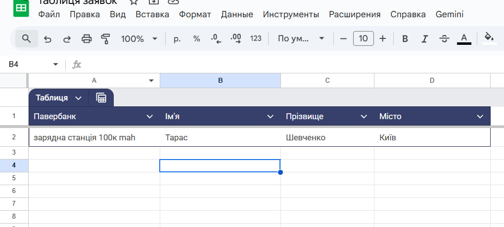
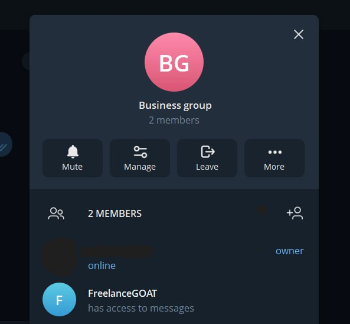

# PROJECT DESCRIPTION
---

## 1. Main problems

Another example of business process automation that is as useful and fast as possible. The main problem was processing a large amount of "raw" data in the form of responses in Google Forms when the buyer created an application. Other inconveniences:
- There is no way to sort data by category, you need to copy it manually to an additional environment (Goodle docs)
- You need to constantly check new incoming orders in real time, you need to check whether a given order has been processed.
- It's difficult to do anything else without constantly "monitoring" the responses.

## 2. Objectives

The main task was to create an environment where it is convenient to search and process orders using automatic filling in the table. Additionally, it was decided to create a business group in Telegram and create a bot that will notify ALL group members about a new unprocessed order.

## 3. Step-by-step solution (screenshots)

1. Creating a new project in Make. Google Forms trigger module to activate a script when a new response is received.

 - example of form design

2. Created a new spreadsheet in Google Docs. Added columns for the required type of information and filtering by data type (it's very convenient to sort the list by a specific type). You can also configure the ability to view and edit the spreadsheet by multiple team members in real time.

 - example of a table for sorting data

3. Telegram bot module for viewing and replying to messages

4. A Telegram bot has been set up in the business group for employees.

There was a problem during the module setup. It was not possible to get the ID address of the business chat, which is why the bot did not understand where to send the message. This is one of the nuances of working with API protocols and privacy settings in services. It was not possible to find by username or by channel address, because it is a private group and it has only a link, which is not suitable for the Telegram module in Make. It was decided to find out the chat ID through an online link to the API that tracks the bot's actions and data processing. Using the bot token, it was possible to find out the chat ID through one message to the group. 

https://api.telegram.org/bot<bot_token>/getUpdates

## 4. Results

As soon as a customer creates a new order in Google Forms, the system automatically transfers the order data to a sorted database in Google Docs. Telegram also receives a real-time notification about a new order from the customer.

Summary of work performed:

Designed and implemented no-code automation that allows you to automatically transfer incoming orders from Google Forms to the Google Docs database. Additionally, a Telegram bot was created and configured to send notifications when a new order arrives.

Tools used:
- Telegram API documentation
- Google API documentation
- Make(Integromat)