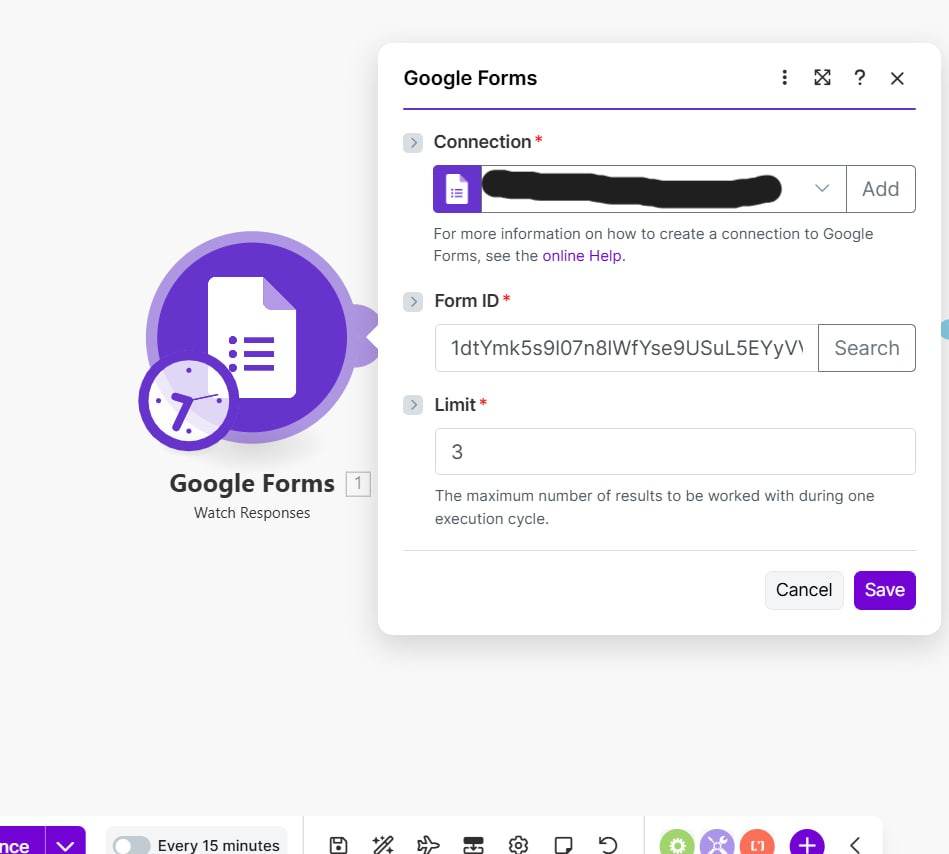
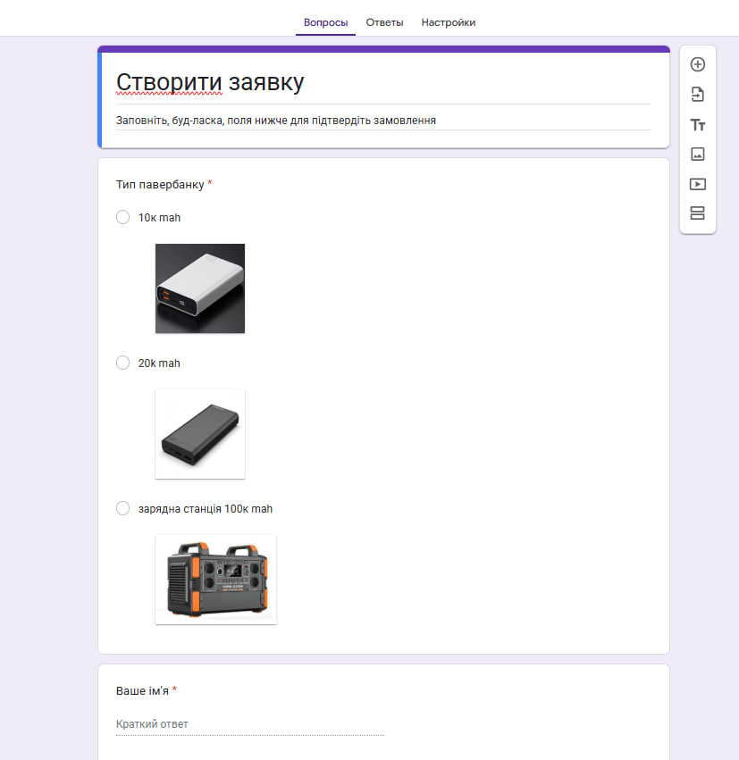
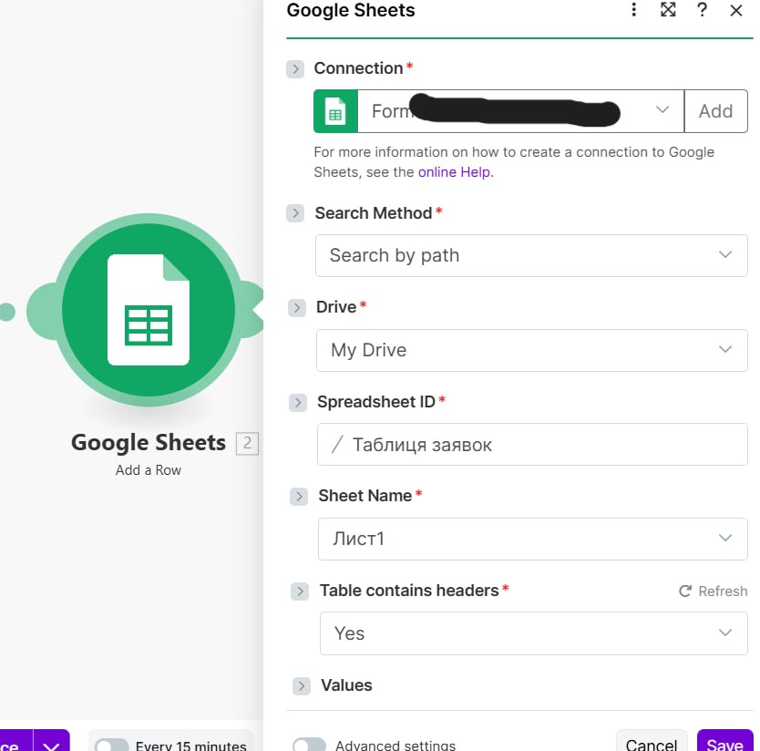
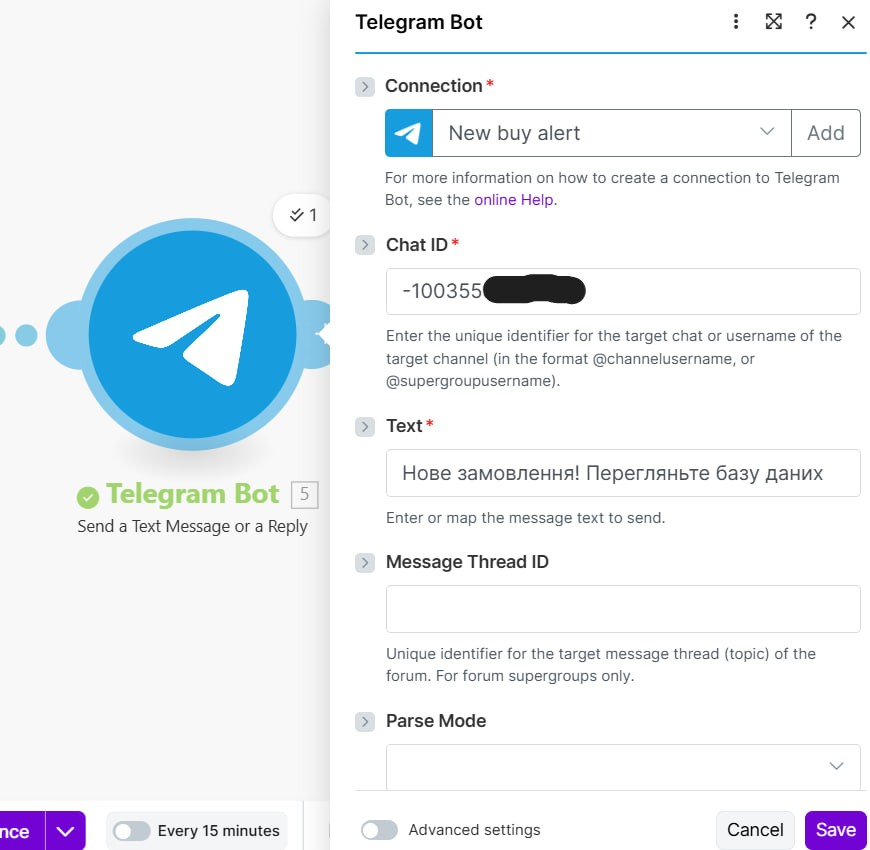

# ОПИС ПРОЄКТУ
---

## 1. Головні проблеми

Ще один приклад автоматизації бізнес процесу який максимально корисний та швидкий. Головна проблема була у обробці великої кількості "сирих" даних у вигляді відповідей у Гугл Формах при створенні покупцем заявки. Інші незручності:
- Немає можливості відсортувати дані по категоріям, потрібно копіювати вручну у додаткове середовище (Goodle docs)
- Потрібно постійно перевіряти нові надходження заявок у реальному часі, потрібно звіряти чи було в обробці дане замовлення.
- Займатися чимось іншим без постійного "моніторингу" відповідей - складно.

## 2. Задачі

Головною задачею було створення середовища де зручно шукати та обробляти замовлення за допомогою автоматичному заповненню у таблицю. Додатково було прийнято рішення створити бізнес-группу у Telegram та створити бота який буде сповіщувати повідомленням ВСІХ учасників групи про нове необроблене замовлення.

## 3. Поетапне рішення (скріншоти)

1. Створення нового проэкту у Make. Тригер-модуль Forms Google для активації скрипту при отриманні нової відповіді.

 - приклад оформлення бланк-форми

2. Створив нову таблицю у Google Docs . Додав колонки для необхідного типу інформації та фільтрацію по типу даних (дуже зручно сортувати список по окремому типу). Також можна налаштувати можливість перегляду та редагування таблиці кількома учасниками команди у реальному часі.

 - приклад таблиці для сортування даних

3. Модуль Telegram бота для перегляду і відповіді на повідомлення

4. Сам налаштований Telegram бот у бізнес групі для співробітників.

У ході налаштування модуля виникла проблема. Не було можливості отримати ID адресу бізнес чату, через що бот не розумів куди відправляти повідомлення. Це один із нюансів роботи з API протоколами та налаштуваннями приватності у сервісах. Знайти по імені користувача , або по адресі каналу не було можливості, бо це приватна група і вона має лище посилання, що не підходить для модуля Telegram у Make. Було вирішено з'ясувати ID чату через онлайн посилання на API яке відстежує дії бота та обробку ним даних. За допомогою токена бота вийшло з'ясувати ID чату через одне повідомлення у групу. 

https://api.telegram.org/bot<токен бота>/getUpdates

## 4. Результати

Як тільки у Гугл Формах створено клієнтом нову заявку, система автоматично переносить дані про замовлення у сортовану базу даних в середовищі Google Docs. Також у Телеграм надходить повідомлення у реальному часі про нове замовлення від клієнта.

Підсумок виконаної роботи:

Було спроєктовано та реалізовано no-code автоматизацію, яка дозволяє автоматично переносити вхідні замовлення з Google Forms до бази даних  Google Docs. Додатково було створено та налаштовано Телеграм-бота , який надсилає повідомлення у разі надходження нового замовлення.

Інструменти:
- Telegram API documentation
- Google API documentation
- Make(Integromat)